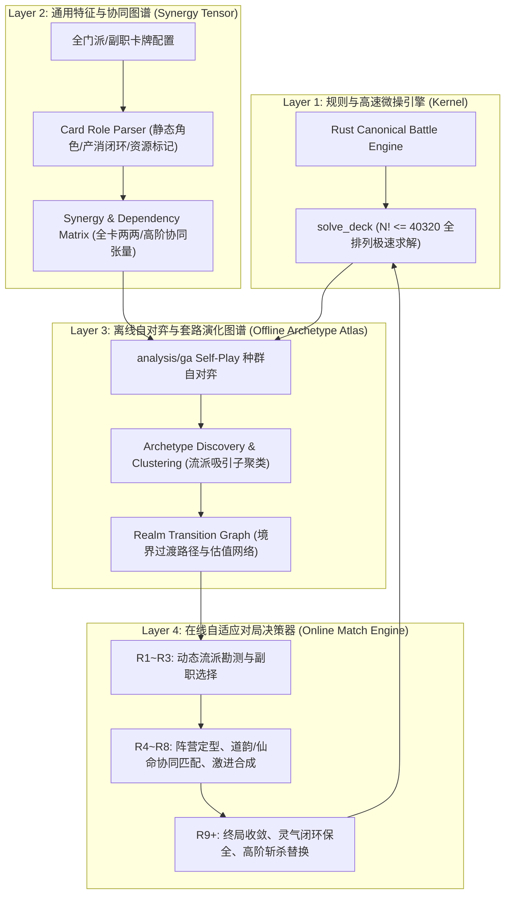
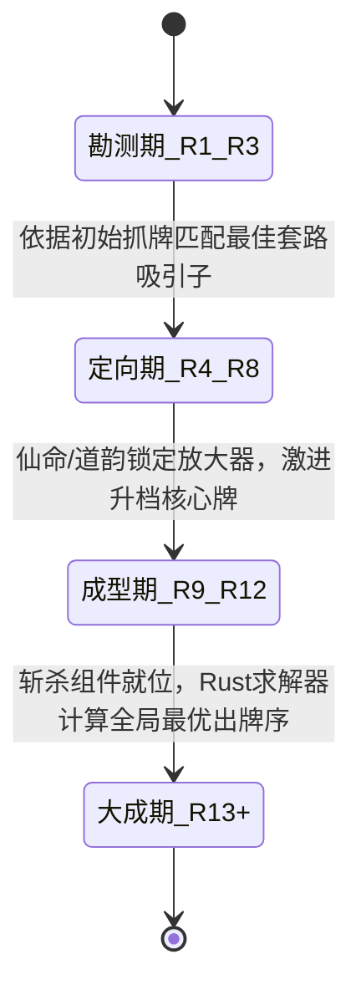

<!-- topic: solver -->
# 全角色任意套路自训练与博弈框架（Universal Archetype Framework）

> **核心宗旨**：不抄人类打法、不搞单卡硬编码、不拟合单局经验。
> 依托 Rust 规则引擎的高速仿真能力，构建**任意角色、任意副职、任意流派**皆可自主训练、自动发现、自适应演化并超越人类的通用 AI 框架。

---

## 1. 架构总览与分层设计

---

## 2. 核心系统拆解

### 2.1 协同张量与资源流模型（通用特征，杜绝硬编码）
任何门派与角色的卡牌本质上都是**资源的生产、消耗、转化与时序放大**：

| 门派 / 副职 | 核心资源代数 | 典型放大器 | 终结手段 |
|:---|:---|:---|:---|
| **云灵剑宗** | 连云链（连续成链）、剑意（数值加成）、狂剑（次数累加） | 再次行动（游龙/凌波）、伤害段数倍增 | 流云乱剑、闪影剑、狂剑零式 |
| **锻玄宗** | 气势（攻击缩放）、体魄（生命上限/护盾）、身法（闪避/位移） | 双端引擎（朝气蓬勃）、冥影身法 | 崩拳系、玄心斩魄、百杀破境掌 |
| **七星阁** | 星力（直接增伤）、卦象（随机/定向修正）、星弈（时序锁定） | 算卦/转卦、星轨连动 | 众星拱月、紫微天灵、天机破 |
| **五行道盟** | 五行相生（水生木生火生土生金）、五行相克、纯五行激活 | 相生循环、五行生灭 | 五行天劫、鼎盛金煞、混元浑天 |
| **六大副职** | 丹药（灵气/上限）、画道（调色/多动）、阵纹（持续增益/冲击）、琴道（困缚/减气） | 运笔如飞、回响阵纹、天音困仙 | 辅助任何门派形成闭环 |

**形式化表征**：
每张卡 $c$ 抽象为一个特征向量 $\vec{f}(c)$：
$$\vec{f}(c) = \langle \Delta\text{Anima}, \Delta\text{Dmg}, \Delta\text{Blk}, \vec{R}_{\text{produce}}, \vec{R}_{\text{consume}}, \mathbb{I}_{\text{extra\_action}}, \mathbb{I}_{\text{multi\_hit}}, \text{Priority} \rangle$$
卡组的协同度不是简单加和，而是**资源流图的连通性与净流动率**：
$$\text{Synergy}(D) = \sum_{r \in \text{Resources}} \min\left(\text{Prod}(r), \text{Cons}(r)\right) \cdot w_r + \text{ActionMultiplier}(D)$$

---

### 2.2 离线自对弈与套路吸引子挖掘（超越人类认知的源泉）
人类往往习惯于官方预设或论坛热门套路，而**自对弈演化（Self-Play Evolution）**能在无偏见的策略空间中发现反直觉的冷门杀招：

1. **Profile 自动化覆盖**：
   - 遍历全 168 个 `Profile`（24 位角色 × 7 个副职选项）。
   - 初始种群完全由合法卡池生成，不依赖人类回放或预设模板。
2. **Learner vs Predator 对抗演化**：
   - Learner 针对当前 Predator 种群优化最佳应对；
   - Predator 专门针对 Learner 的软肋（如爆发斩杀、高抗苟活、断灵控制）演化克制卡组；
   - 胜出构筑存入 Niche League Archive（分生态位档案库）。
3. **套路图谱（Archetype Atlas）聚类**：
   - 对 League Archive 中高胜率（`adjWin >= 0.85`）构筑提取 `engineSignature`；
   - 聚类为每个角色的 **3~5 大核心吸引子（Attractors）**，例如炎雪自动聚类出：
     - Attractor A: `云剑多动机`（双凌波+游龙+画师多动）
     - Attractor B: `多段连云爆发`（流云乱剑+柔心+炽火炎刃）
     - Attractor C: `剑意穿透流`（万剑归宗+凝意+剑防转伤）
     - Attractor D: `狂剑持续汲取`（狂剑零式+风卷残云+体魄护盾）

---

### 2.3 动态套路收敛与全链路过渡（从开局到吃鸡的宏观决策）

在实战对局中，真正的难点不是知道终局卡组长什么样，而是**在手牌极其随机的情况下，如何平滑过渡而不猝死**：

1. **阶段 1：勘测期（R1 ~ R3，炼气期）**
   - **核心法则**：**数值与升阶优先，不强行定死路线**。
   - 激进同名合成：优先合出 2 星、3 星基础战力牌，保住血量（如人类示范的第 3 轮 3 星探云，保送 9 轮 100 血）。
   - 动态副职评估：计算当前手牌与 6 个副职的亲和度投影，选择边际收益最高的副职，绝不死板绑死炼丹。

2. **阶段 2：定向与发育期（R4 ~ R8，筑基~金丹期）**
   - **核心法则**：**锚定套路吸引子，道韵与仙命直奔核心放大器**。
   - **道韵选择模型**：
     $$\text{Score}(\text{DaoYun}) = \max_{\text{Attractor } A} \left( \mathbb{P}(A \mid \text{Hand}) \cdot \text{Impact}(c, A) \right)$$
     如果当前走向多动云剑，道韵直接抓【云剑•凌波】或【云剑•游龙】；如果走向剑意流，直奔【万剑归宗】；由吸引子概率动态驱动，零 ID 硬编码。
   - **手牌管理护栏**：
     - 套路核心发动机（Engine）与未来高境界组件（Key Component）绝对保护，严禁当作余牌炼化。
     - 淘汰脱离主套路的孤立填充牌，转化为修为冲关。

3. **阶段 3：成型与大成期（R9+，元婴~化神期）**
   - **核心法则**：**灵气闭环保证、斩杀组件就位、Rust 全局穷举**。
   - **动态灵气守卫**：检查全盘耗灵与产灵差额 $\Delta = \sum \text{Cost} - \sum \text{Gain}$。若 $\Delta > 0$，强制在候选集中配置最佳供灵发动机，杜绝卡手空转。
   - **微观执行**：将当前套路的最优候选卡组输入 Rust `solve_deck`，在毫秒级内完成 40,320 种全排列模拟，找到在真实判定规则下输出最高、战损最小的绝对最优牌序。

---

### 2.4 拓扑序时钟硬约束与修为影子价格（摆脱人工调权重的数学基石）

超越人类玩家的通用决策必须彻底摆脱“人工加减分/单卡权重调整”的泥潭，依靠底层数学约束自律收敛：

1. **时钟拓扑序硬约束（Topological Clock Ordering）**：
   - 任何卡组排列在时序上构筑为一个动态有向图。对于任意卡牌 $c_i$ 位于格位 $i$（执行时钟 $t_i = i$）：
     - 若 $c_i$ 为资源 $r$ 的消费节点（$\text{Cons}(r) > 0$），其触发收益严格依赖前序时钟产出：
       $$\text{ResourceBalance}(r, t) = \sum_{j < t} \text{Prod}(r, j) - \sum_{j < t} \text{Cons}(r, j)$$
     - **拓扑前置硬惩罚**：若在时钟 $t$ 处消费节点触发时 $\text{ResourceBalance}(r, t) \le 0$，其放大系数判定为 0 效；
     - 若生产节点位于末尾（$t \ge 7$）且后续已无消费者，其未消耗产出判定为**“流量浪费（Orphan Flow）”**。
   - 此数学硬约束天然惩罚“核心垫底、防牌顶头”的畸形反人类排阵，全门派自动生效，无需单卡规则特判。

2. **宏观修为拉格朗日影子价格（Shadow Price of Cultivation）**：
   - 人机（PuppetLevel=5）具有确定性境界跃迁时序（R3/R6/R9/R12）。
   - 设当前轮次为 $R$，距人机下一次跃迁的剩余轮次为 $\Delta R$。定义状态价值函数：
     $$V(\text{Realm}, \text{Exp}, \text{Hand}) = \mathbb{P}(\text{Win} \mid \text{Realm}) + \lambda \cdot (\text{Realm}_{\text{target}} - \text{Realm})$$
   - 1 点修为的边际价值（影子价格 $\lambda$）：
     $$\lambda(\text{Exp}) = \frac{\partial V}{\partial \text{Exp}} \propto \frac{\Delta \mathbb{P}_{\text{LethalSpike}}}{\max(1, \Delta R)}$$
   - 在生死轮前夕（如 R11/R12 距对手化神仅 1 轮），$\lambda(\text{Exp})$ 趋近无穷大，动态规划自动驱动 AI 将非核心闲置卡牌精准折算变现破境，从根本上替代人工硬写的 `rush_threshold`。

---

## 3. 落地实施路线图

1. **第一阶段：特征提取与图谱集成**
   - 将 `analysis/ga/src/card-role.ts` 中的资源解析与角色标签移植/桥接为通用卡牌评估函数；
   - 导入 `analysis/ga/data/deck-archive.json` 中的 168 个 profile 离线训练成果，生成各角色的 **套路吸引子数据库（Archetype Atlas）**。

2. **第二阶段：重构运行时决策器（Runtime Engine）**
   - 替换 `full-match-loop.py` 中的硬编码道韵表、固定副职参数和手算伤害公式；
   - 接入动态套路勘测器（Dynamic Archetype Tracker）：自动选副职、自动选仙命、自动选道韵。

3. **第三阶段：全角色实战与自进化验证**
   - 先后在**云灵剑宗（炎雪/龙瑶）**、**七星阁（花沁蕊/吴策）**、**锻玄宗（李㵘/屠馗）**上执行无头实机对局；
   - 检验框架在面对地狱傀儡时能否根据发牌自主演化出不同的必胜套路，达成真正的**全角色连续克敌**。
